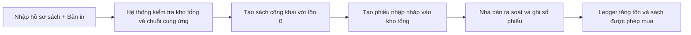
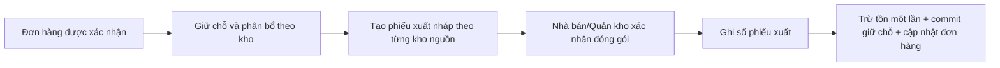

# Kế hoạch hợp nhất luồng Bản in, thêm sách và chứng từ kho

Ngày: 2026-08-01
Trạng thái: Đã được duyệt và đã triển khai source cục bộ — xem biên bản nghiệm thu `194-book-print-edition-and-warehouse-document-local-acceptance.md`
Phạm vi: sách vật lý của Nhà bán, kho tổng, phiếu nhập/xuất/điều chuyển/kiểm kê, hiển thị công khai và xuất chứng từ

Quyết định đã duyệt:

- Tên hiển thị từ bản in thứ hai dùng hậu tố `— Tái bản lần N`.
- Thêm sách tạo phiếu nhập ở trạng thái nháp; tồn chỉ tăng khi ghi sổ phiếu.
- Gợi ý kho giai đoạn đầu dùng dữ liệu nội bộ, không dùng bản đồ hoặc dịch vụ trả phí.

## 1. Mục tiêu nghiệp vụ

1. Thêm `Bản in` vào hồ sơ sách và hiển thị đúng tên thương mại theo lần in.
2. Hoàn tất thêm sách đồng thời tạo một phiếu nhập nháp vào kho tổng; không ghi tồn trực tiếp ngoài ledger.
3. Phân biệt rõ:
   - nhập một sản phẩm/bản in mới;
   - nhập bổ sung một sản phẩm/bản in đã có.
4. Sách tồn bằng 0 vẫn có URL công khai và có thể tìm kiếm, nhưng không xuất hiện trong các dải “Sách mới”/danh mục và không thể mua.
5. Thu gọn khai báo kho/chuỗi cung ứng về một lần trong form thêm sách, tùy mô hình của Nhà bán.
6. Sinh phiếu xuất từ đơn hàng và phân bổ tồn kho; không trừ tồn hai lần.
7. Giữ nguyên vai trò của phiếu điều chuyển và kiểm kê; ẩn điều chuyển khi chỉ có một kho.
8. Cho phép xem bản in, in trình duyệt, tải PDF và Excel cho mọi loại phiếu.

## 2. Kết quả audit hiện trạng

- `books` chưa có trường lần in; API đang chỉ trả `title` gốc.
- Luồng tạo sách hiện đặt `status` và `publishing_status` về `draft`, sau đó ghi thẳng `warehouse_stocks.quantity` từ `books.stock`.
- Form đã bắt đầu gom chọn kho và chuỗi cung ứng, nhưng sau khi tạo vẫn chuyển sang trang quy trình xuất bản; điều này tạo cảm giác phải khai báo lại.
- `warehouse_documents` đã hỗ trợ `receipt`, `dispatch`, `transfer`, `count`, có `order_id`, state machine, event và ledger bất biến.
- Phiếu nhập/phiếu xuất khi `posted` đã tăng/giảm tồn và đồng bộ `books.stock`.
- Dịch vụ giữ chỗ đơn hàng hiện cũng giảm `warehouse_stocks` khi commit. Nếu chỉ gắn thêm phiếu xuất mà không thiết kế lại, một đơn hàng có thể bị trừ kho hai lần.
- Phân bổ giữ chỗ đã biết chính xác `warehouse_stock_id`; đây phải là nguồn dữ liệu ưu tiên khi tạo/gợi ý phiếu xuất.
- Kho hiện chỉ có địa chỉ dạng chuỗi, chưa có tỉnh/huyện hoặc tọa độ chuẩn hóa nên chưa đủ dữ liệu để khẳng định “kho gần nhất” theo khoảng cách địa lý.
- Chưa có thư viện PDF/XLSX trong `composer.json`.

## 3. Các quyết định đề xuất

### 3.1. Tên sách và Bản in

- Thêm `books.print_edition` kiểu số nguyên không dấu, bắt buộc, mặc định `1`, giá trị nhỏ nhất `1`.
- Không sửa vĩnh viễn `books.title`. Tạo thuộc tính/API `display_title` để tránh làm hỏng slug, tìm kiếm, SEO và lịch sử đơn hàng.
- Quy tắc đề xuất:
  - `print_edition = 1`: `display_title = title`;
  - `print_edition >= 2`: `display_title = "{title} — Tái bản lần {print_edition}"`.
- Tất cả thẻ sách, chi tiết sách, giỏ hàng, đơn hàng và bản in chứng từ dùng `display_title`; form quản trị vẫn cho thấy cả tên gốc và lần in.
- Tìm kiếm khớp tên gốc, ISBN/SKU và chuỗi hiển thị suy diễn; không lưu chuỗi “Tái bản” vào cột tên.

> Điểm cần xác nhận: yêu cầu có chữ “Tái bán”, nhưng thuật ngữ xuất bản phù hợp là “Tái bản”. Phương án này dùng “Tái bản lần N” để người mua biết chính xác lần in.

### 3.2. Kho tổng

- Thêm `vendors.primary_warehouse_id`, khóa ngoại nullable tới `warehouses`.
- Một Nhà bán có đúng một kho tổng trước khi được thêm sách vật lý.
- Kho tổng phải đang hoạt động và thuộc chính Nhà bán.
- Không cho xóa/vô hiệu hóa kho tổng nếu chưa chọn kho thay thế.
- Backfill:
  - Nhà bán chỉ có một kho: tự gán kho đó;
  - nhiều kho: ưu tiên kho đang được dùng nhiều nhất cho tồn hiện hữu, đồng thời xuất báo cáo cần rà soát;
  - không có kho: giữ null và chặn thêm sách vật lý bằng hướng dẫn tạo kho.
- Không tự thay đổi dữ liệu production trong migration; chạy lệnh backfill riêng, có chế độ `--dry-run` và báo cáo trước/sau.

### 3.3. Trạng thái công khai và khả năng mua

Không dùng một cột `status` để đại diện đồng thời kiểm duyệt, khả năng tìm thấy và tồn kho. Chuẩn hóa thành các khái niệm:

- `catalog_status`: hồ sơ nháp/công khai/ẩn/ngừng bán;
- `discoverability` được suy diễn:
  - `search_only` khi công khai nhưng tồn khả dụng bằng 0;
  - `browse_and_search` khi công khai và tồn khả dụng lớn hơn 0;
- `is_purchasable` được suy diễn từ: công khai + đủ chuỗi cung ứng theo chính sách + giá hợp lệ + tồn khả dụng lớn hơn 0.

Hành vi bắt buộc:

| Trạng thái | URL trực tiếp | Tìm kiếm | Sách mới/danh mục | Nút mua |
|---|---:|---:|---:|---:|
| Công khai, tồn 0 | Có | Có | Không | Tắt, ghi “Tạm hết hàng” |
| Công khai, tồn > 0 | Có | Có | Có | Có |
| Nháp/ẩn | Không công khai | Không | Không | Không |

Luồng tạo chuẩn tự hoàn tất kiểm tra hồ sơ và chuỗi cung ứng ngay trong form. Khi hợp lệ, sách được công khai mà không bắt người dùng đi qua một trang khai báo trùng lặp. Trang quy trình xuất bản chỉ còn dùng cho chỉnh sửa nâng cao, phản hồi kiểm duyệt hoặc khắc phục hồ sơ thiếu.

## 4. Hai luồng phiếu nhập

### 4.1. Sản phẩm hoặc Bản in mới

- Nguồn hàng là đơn vị in ngoài hệ thống, không tạo `organization`, `vendor` hoặc quan hệ pháp lý giả.
- Phiếu lưu tên đơn vị in tự khai báo dưới dạng snapshot, ví dụ `external_counterparty_name`; giao diện ghi rõ “Đơn vị ngoài hệ thống”.
- Số lượng ban đầu được phép bằng `0`. Nếu lớn hơn `0`, số lượng chỉ điền trước vào dòng phiếu nhập nháp; chưa cộng tồn cho tới khi phiếu được `posted`.
- Sau khi tạo thành công, chuyển người dùng tới chi tiết phiếu nhập với CTA chính “Kiểm tra và ghi sổ”, không chuyển sang bước gắn chuỗi cung ứng lần hai.

### 4.2. Nhập bổ sung sản phẩm/Bản in đã có

- Không tạo bản ghi `books` mới.
- Cho lọc nhanh “Đã hết hàng”, “Sắp hết hàng”, ISBN/SKU, lần in.
- Có thể nhập từ kho ngoài sàn hoặc đơn vị in ngoài hệ thống; lưu snapshot nguồn trên phiếu.
- Chặn chọn nhầm bản in bằng cách hiển thị `display_title`, ISBN/SKU, ảnh bìa và lần in trên cùng một hàng.

### 4.3. Dữ liệu chứng từ cần bổ sung

- `warehouse_documents.origin`: `manual`, `book_creation`, `order_fulfillment`, `inventory_adjustment`.
- `warehouse_documents.receipt_mode`: nullable, `new_print_edition` hoặc `restock_existing`.
- `warehouse_documents.external_counterparty_name`: nullable.
- `warehouse_documents.snapshot`: JSON chứa tên/địa chỉ/kho/đối tác tại thời điểm lập phiếu để bản tải về không thay đổi theo hồ sơ sau này.
- `warehouse_documents.order_id` tiếp tục dùng cho phiếu xuất.
- Dùng `operation_key` để tạo phiếu idempotent; gửi lại request không sinh phiếu thứ hai.

## 5. Chuỗi cung ứng theo loại Nhà bán

Tạo một service/policy duy nhất, ví dụ `BookSupplyChainRequirementResolver`, để cả API và UI nhận cùng một cấu hình:

- `self_supplied`/Nhà xuất bản tự cung tự cấp:
  - chỉ hiện kho xuất hàng;
  - kho được cố định về kho tổng;
  - Nhà xuất bản/Nhà cung cấp/Đơn vị chịu trách nhiệm được suy ra từ hồ sơ tổ chức hợp lệ của chính Nhà bán;
  - dữ liệu demo dùng trạng thái `demo_accepted` và nhãn mô phỏng, không biến thành quan hệ đã xác minh.
- `bookstore`/Nhà bán phân phối:
  - phải chọn đủ các vai trò mà policy trả về;
  - chỉ chọn trong các quan hệ hợp lệ của Nhà bán;
  - khai báo một lần trong form thêm sách, có tóm tắt trước khi gửi.
- Sách cũ/đặc thù tiếp tục đi theo policy riêng, không ép quan hệ không phù hợp.

API `GET /api/vendor/books/create-scope` nên trả:

- `primary_warehouse` và lý do nếu chưa sẵn sàng;
- `business_model`;
- `required_commercial_roles`;
- `commercial_party_options`;
- `can_create_physical_book` và danh sách `blocking_reasons`.

## 6. Phiếu xuất gắn đơn hàng

### 6.1. Nguyên tắc tồn kho duy nhất

Phiếu xuất `posted` là điểm duy nhất làm giảm `warehouse_stocks` và ghi `warehouse_stock_ledgers` cho đơn hàng. Không vừa commit reservation vừa trừ tiếp khi ghi sổ phiếu.

- Tạo tối đa một phiếu xuất cho mỗi `order + vendor + source warehouse`; đơn nhiều kho sinh nhiều phiếu có liên kết chéo rõ ràng.
- Dòng phiếu được tạo từ `inventory_reservation_allocations`, không cho tăng quá số đã phân bổ.
- Ghi sổ phiếu, trừ tồn, chuyển reservation sang committed và cập nhật trạng thái hoàn tất kho trong cùng transaction, khóa dòng tồn theo thứ tự ổn định.
- Retry dùng operation key cố định; không trừ lần hai.
- Hủy đơn trước khi ghi sổ sẽ release reservation và hủy phiếu nháp; sau khi ghi sổ phải đi qua trả hàng/phiếu nhập hoàn chứ không sửa ledger cũ.

### 6.2. Gợi ý kho gần người mua

Không dùng dịch vụ bản đồ trả phí. Chia hai mức:

1. Mức bắt buộc trong đợt đầu: ưu tiên allocation còn đủ hàng; nếu có nhiều lựa chọn thì cùng tỉnh, cùng quận/huyện, sau đó ít lần tách kiện và cuối cùng là kho tổng.
2. Mức nâng cao sau khi dữ liệu địa chỉ được chuẩn hóa: thêm tỉnh/huyện/xã cho kho và địa chỉ giao hàng; cho phép tọa độ do quản trị nhập hoặc nguồn miễn phí đã được phê duyệt, rồi tính khoảng cách nội bộ.

Hệ thống chỉ “gợi ý”, hiển thị lý do gợi ý và cho người có quyền đổi kho trước khi giữ chỗ/ghi sổ. Khi đổi phải chạy lại kiểm tra tồn và allocation.

## 7. Điều chuyển, kiểm kê và xuất file

- Phiếu điều chuyển giữ state machine và hai ledger cân bằng như hiện tại.
- API scope trả `can_transfer = active_warehouse_count >= 2`.
- Khi chỉ có một kho:
  - ẩn tab/nút tạo điều chuyển;
  - nếu truy cập URL trực tiếp, API trả lỗi nghiệp vụ có hướng khắc phục;
  - vẫn hiển thị lịch sử điều chuyển cũ nếu có.
- Phiếu kiểm kê giữ `expected_quantity`, `actual_quantity`; chỉ tạo delta khi ghi sổ.
- Mọi phiếu có ba hành động:
  - `In phiếu`: trang HTML tối ưu A4, dùng `window.print()`;
  - `Tải PDF`: file sinh phía server từ cùng snapshot/template;
  - `Tải Excel`: `.xlsx` với sheet Thông tin phiếu, Dòng hàng, Lịch sử trạng thái.
- Đề xuất dependency mã nguồn mở: `barryvdh/laravel-dompdf` và `phpoffice/phpspreadsheet`. Việc thêm dependency cần audit license/CVE, khóa version và phê duyệt trước khi cài; không dùng dịch vụ trả phí.
- Tên file: `{document_code}-{yyyyMMdd}.pdf|xlsx`; số lượng dùng kiểu số, ngày giờ theo múi giờ ứng dụng, chống formula injection cho Excel.

## 8. Thiết kế giao diện

### 8.1. Form thêm sách

- Một luồng có tối đa bốn nhóm hiển thị trên cùng trang: Thông tin sách, Giá & Bản in, Kho & nhập ban đầu, Xuất bản & cung ứng.
- `Bản in` nằm cùng hàng ISBN/SKU, input số tối thiểu 1, có preview tên hiển thị ngay bên dưới.
- Kho tổng hiển thị dạng read-only có link “Quản lý kho”; không dùng dropdown khi chỉ có lựa chọn hợp lệ duy nhất.
- Dùng progressive disclosure:
  - tự cung tự cấp: ẩn các trường đối tác đã suy ra, chỉ hiện bản tóm tắt;
  - Nhà bán phân phối: hiện đúng các vai trò bắt buộc.
- Khối nhập ban đầu có số lượng, vị trí kệ và tên đơn vị in ngoài hệ thống; giải thích rõ “Tồn chỉ tăng sau khi ghi sổ phiếu”.
- CTA duy nhất: “Tạo sách và phiếu nhập”. Sau thành công hiển thị mã sách, mã phiếu và trạng thái công khai/tồn kho.
- Validation đặt cạnh trường, focus lỗi đầu tiên, giữ bản nháp khi request thất bại; thao tác bàn phím và màn hình nhỏ không bị tràn ngang.

### 8.2. Trang phiếu

- Bộ lọc theo loại, trạng thái, kho, đơn hàng, mã phiếu, khoảng ngày; lưu filter trên URL.
- Bảng desktop và card mobile đều hiển thị: mã phiếu, loại, nguồn phát sinh, kho, số dòng/tổng số lượng, đơn hàng, trạng thái và người phụ trách.
- Chi tiết phiếu có timeline trạng thái, snapshot đối tác/kho, dòng hàng kèm ảnh bìa/ISBN/Bản in, và một CTA chính theo trạng thái.
- Tạo phiếu nhập có bước chọn rõ “Sản phẩm/Bản in mới” hoặc “Nhập bổ sung sản phẩm đã có”. Trường hợp mới chuyển sang form thêm sách; không cho tạo hai hồ sơ sản phẩm trùng nhau từ hai trang.
- Phiếu xuất hiển thị đơn hàng, người nhận ở mức quyền cho phép, allocation, kho được gợi ý và lý do gợi ý.
- Trạng thái không chỉ phân biệt bằng màu; luôn có nhãn tiếng Việt và icon nhất quán.

## 9. Kế hoạch triển khai theo batch

### Batch 1 — ADR và nền dữ liệu

- Chốt thuật ngữ tên hiển thị, thời điểm công khai và thời điểm ghi sổ.
- Migration thêm `print_edition`, `primary_warehouse_id`, metadata/origin của chứng từ và trường địa chỉ chuẩn hóa tối thiểu.
- Model casts/fillable/index/foreign key; lệnh backfill có dry-run và báo cáo.
- Down migration phải phục hồi schema an toàn; không xóa dữ liệu nghiệp vụ đã có ngoài các cột mới.
- Gate: migration fresh, migration down/up SQLite tạm, backfill idempotency, test dữ liệu legacy mặc định lần in 1.

### Batch 2 — Miền sách và khả năng hiển thị

- Thêm `display_title`, `discoverability`, `is_purchasable` vào resource/policy.
- Tách query search khỏi query danh mục/Sách mới; tồn 0 chỉ search/direct link.
- Toàn bộ UI công khai dùng `display_title` và trạng thái hết hàng rõ ràng.
- Gate: feature tests cho bốn bề mặt URL/search/category/new; frontend tests cho card/detail/cart.

### Batch 3 — Kho tổng và chuỗi cung ứng một lần

- Thêm API create-scope và resolver theo mô hình Nhà bán.
- Form thêm sách tự khóa kho tổng, tự suy ra vai trò của đơn vị tự cung tự cấp, chỉ hỏi các vai trò thật sự thiếu.
- Loại bỏ redirect bắt buộc sang trang khai báo lần hai; giữ trang publishing cho ngoại lệ/chỉnh sửa.
- Gate: nxbkimdong/self-supplied, bookstore nhiều đối tác, demo_accepted, thiếu kho tổng, quan hệ không thuộc vendor.

### Batch 4 — Tạo sách và phiếu nhập nháp nguyên tử

- Tạo application service dùng transaction để tạo sách tồn 0 + commercial parties + receipt draft.
- Không `WarehouseStock::updateOrCreate(... quantity = initial_stock)` trong controller tạo sách.
- Upload file phải được dọn nếu transaction thất bại; retry không tạo sách/phiếu trùng.
- Luồng nhập bổ sung dùng Book hiện hữu và cùng receipt service.
- Gate: atomic rollback, idempotency, external counterparty snapshot, quantity 0, posting receipt cập nhật ledger/projection.

### Batch 5 — Phiếu xuất từ đơn hàng

- Tạo service dựng dispatch từ reservation allocations, chia theo kho nguồn.
- Chuyển điểm trừ tồn sang thao tác post dispatch duy nhất và phối hợp trạng thái reservation/order trong cùng transaction.
- Thêm gợi ý kho mức 1 và khả năng đổi kho có re-allocation.
- Gate: không trừ hai lần, thiếu tồn rollback, retry idempotent, đơn nhiều sách/nhiều kho, hủy trước/sau posting, tranh chấp đồng thời.

### Batch 6 — Giao diện Trang phiếu và điều kiện điều chuyển

- Thiết kế lại danh sách/chi tiết/tạo phiếu theo mục 8.
- Ẩn tạo điều chuyển khi chỉ một kho ở cả UI và API.
- Liên kết hai chiều đơn hàng ↔ phiếu xuất, sách ↔ phiếu nhập.
- Gate: component/route tests, keyboard/focus, responsive 375/768/1440, empty/loading/error states.

### Batch 7 — In/PDF/Excel

- Chốt và cài dependency mã nguồn mở sau khi được phê duyệt.
- Một DTO/snapshot và một bộ formatter dùng chung cho HTML/PDF/XLSX để tránh lệch số liệu.
- Authorization theo vendor/warehouse assignment; không lộ dữ liệu đơn vị khác.
- Gate: chữ Việt, A4 nhiều trang, tổng số lượng, formula injection, quyền truy cập, file name/content-type.

### Batch 8 — Hồi quy và rehearsal release

- Chạy test mục tiêu từng batch, rồi full backend/frontend, lint và production build.
- Rehearsal migration/backfill trên bản sao database không chứa credential thật.
- Kiểm tra browser cục bộ cho thêm sách, receipt, search-only, restock, order dispatch, single-warehouse và export.
- Viết biên bản acceptance riêng, liệt kê file thay đổi, kết quả gate và rủi ro còn lại.
- Commit/push/deploy/database production là các phê duyệt riêng; hoàn tất local không tự động làm đổi trang công khai.

## 10. Ma trận nghiệm thu tối thiểu

| Tình huống | Kết quả bắt buộc |
|---|---|
| Bản in 1 | Tên công khai không có hậu tố |
| Bản in 2+ | Tên công khai có “Tái bản lần N”, tên gốc không bị sửa |
| Tạo sách số lượng 0 | Có URL + search; không category/new; không mua được; có receipt draft |
| Ghi sổ receipt | Tăng đúng kho tổng, có ledger, `books.stock` đồng bộ, mua được nếu đủ điều kiện |
| Retry tạo sách/receipt | Không sinh bản ghi trùng |
| Restock sách cũ | Không tạo Book mới, tăng tồn sau posting |
| Nhà bán tự cung tự cấp | Chỉ thao tác kho; party được suy ra và hiển thị đúng dữ liệu demo/thật |
| Nhà bán phân phối | Chặn hoàn tất khi thiếu vai trò bắt buộc |
| Đơn một kho | Một dispatch liên kết order; tồn chỉ giảm một lần |
| Đơn nhiều kho | Mỗi kho một dispatch, tổng dòng đúng allocation |
| Chỉ một kho hoạt động | Không có thao tác tạo transfer; truy cập API trực tiếp bị chặn rõ lý do |
| PDF/XLSX | Dữ liệu khớp snapshot, tiếng Việt đúng, không lộ tenant khác |

## 11. Rủi ro và biện pháp kiểm soát

- **Trừ tồn hai lần:** cấm mutation tồn ngoài service posting chứng từ; test song song reservation/dispatch.
- **Lẫn bản in:** hiển thị lần in ở mọi picker và snapshot order/document; không suy đoán chỉ từ ISBN.
- **Sách công khai nhưng thiếu pháp lý:** resolver kiểm tra trước khi công khai; demo_accepted luôn có nhãn mô phỏng.
- **Kho gần nhất sai:** giai đoạn đầu chỉ gọi là “gợi ý phù hợp”, nêu lý do, cho đổi; không hứa khoảng cách khi chưa có dữ liệu chuẩn hóa.
- **Migration gán nhầm kho tổng:** dry-run, báo cáo trường hợp nhiều kho, không tự sửa production.
- **File export lệch dữ liệu:** xuất từ snapshot chứng từ và cùng formatter; không dựng lại từ hồ sơ hiện tại.
- **Form quá dài:** nhóm trường, tự ẩn phần đã suy ra, một CTA chính, tóm tắt trước khi gửi.

## 12. Ba điểm đã được duyệt trước Batch 1

1. Dùng hậu tố đề xuất `— Tái bản lần N` (khuyến nghị) hay đúng chuỗi `Tái bán` như mô tả ban đầu.
2. Phiếu nhập do form thêm sách tạo ở trạng thái `draft` và chỉ tăng tồn sau khi người có quyền ghi sổ (khuyến nghị), hay tự ghi sổ ngay khi số lượng lớn hơn 0.
3. Giai đoạn đầu gợi ý kho theo allocation + tỉnh/huyện + ít tách kiện (khuyến nghị), chưa dùng tọa độ/dịch vụ bản đồ.

Ba điểm trên đã được người dùng duyệt. Việc triển khai source và các cổng nghiệm thu cục bộ được ghi tại biên bản 194; commit, push, deploy và mọi thao tác dữ liệu production vẫn là các phê duyệt riêng.
